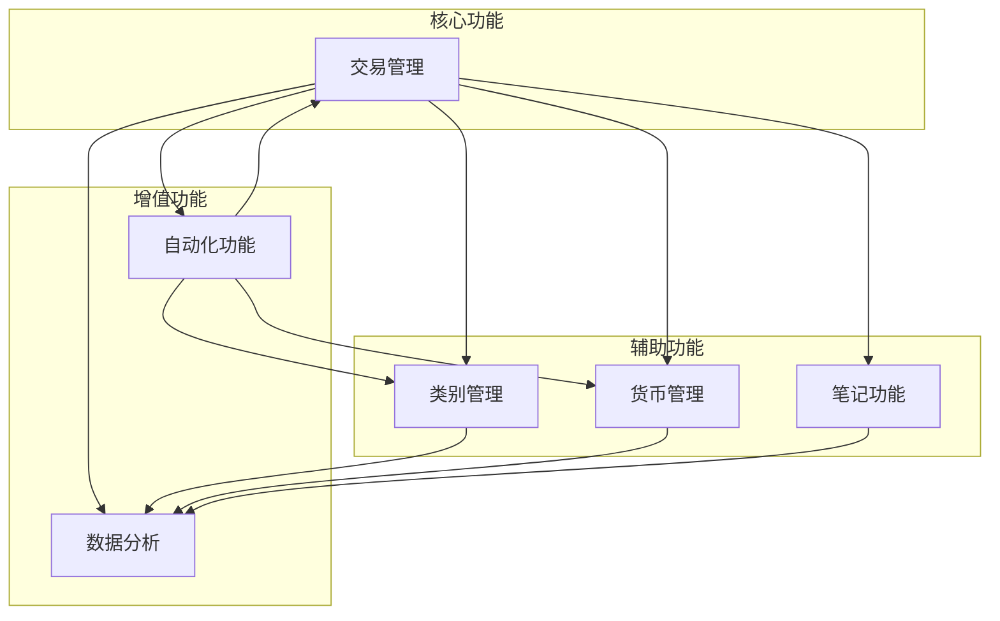
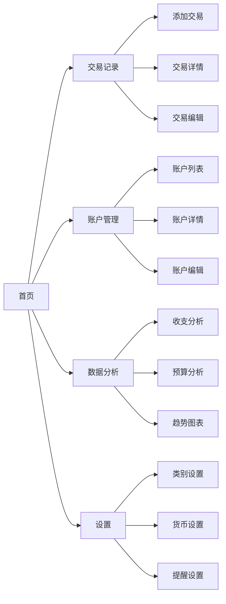

# FinWave App Frontend

这是一个基于 Nuxt 3 的财务记账 Web 应用前端项目。该应用旨在帮助用户追踪和管理财务数据。

## 功能模块

### 1. 交易管理

- 记录日常收入和支出
- 支持多账户交易记录
- 交易分类和标签管理
- 交易历史记录查询
- 支持定期交易设置

### 2. 类别管理

- 自定义收入和支出类别
- 类别预算设置
- 类别统计和分析
- 支持子类别管理
- 类别颜色标记

### 3. 货币管理

- 多币种支持
- 实时汇率更新
- 货币转换计算
- 支持加密货币
- 自定义货币设置

### 4. 笔记功能

- 交易备注记录
- 财务计划记录
- 支持富文本编辑
- 笔记分类管理
- 笔记搜索功能

### 5. 数据分析

- 收支趋势分析
- 类别支出分析
- 账户余额统计
- 预算执行情况
- 可视化图表展示

### 6. 自动化功能

- 定期交易提醒
- 预算超支提醒
- 账单到期提醒
- 自动分类建议
- 数据备份功能

## 功能模块交互



## 页面流程



## 项目结构

````
FinWave-Frontend/
├── assets/                 # 静态资源文件
├── components/             # Vue 组件
│   ├── accounts/          # 账户相关组件
│   ├── admin/             # 管理员组件（可移除）
│   ├── ai/                # AI 对话组件（可移除）
│   ├── analytics/         # 分析图表组件
│   ├── buttons/           # 按钮组件
│   ├── modal/             # 模态框组件
│   ├── nav/               # 导航组件
│   ├── notes/             # 笔记组件
│   ├── reports/           # 报表组件
│   ├── select/            # 选择器组件
│   ├── transactions/      # 交易相关组件
│   └── misc/              # 其他通用组件
├── composables/           # 组合式函数
│   ├── useApiLoader.ts    # API 加载器（需要修改为本地存储）
│   ├── useColor.ts        # 颜色工具
│   ├── useCurrencyFormatter.ts # 货币格式化
│   └── useServer.ts       # 服务器相关（可移除）
├── lang/                  # 国际化语言文件
│   ├── zh-CN.json         # 中文翻译
│   └── en-US.json         # 英文翻译
├── layouts/               # 页面布局组件
├── libs/                  # 工具库
│   ├── api/               # API 相关（需要修改为本地存储）
│   ├── auth/              # 认证相关（可移除）
│   ├── config/            # 配置管理
│   └── toast/             # 通知系统
├── middleware/            # 中间件
│   ├── auth.ts            # 认证中间件（可移除）
│   ├── adminAuth.ts       # 管理员认证（可移除）
│   ├── serverAvailable.ts # 服务器可用性（可移除）
│   └── serverNotAvailable.ts # 服务器不可用（可移除）
├── pages/                 # 页面组件
├── plugins/               # 插件
│   ├── 1.init.ts          # 初始化插件
│   ├── 2.api.ts           # API 插件（需要修改为本地存储）
│   ├── sw.ts              # Service Worker（PWA 相关）
│   └── toasts.ts          # 通知插件
├── public/                # 公共静态文件
└── new_project/           # 新项目相关文件
## 技术栈

- **框架**: Nuxt 3
- **UI 框架**: Tailwind CSS + DaisyUI
- **图表**: ApexCharts
- **日期处理**: Moment.js
- **国际化**: @nuxtjs/i18n
- **状态管理**: Vue 3 Composition API
- **类型检查**: TypeScript

## 主要依赖

- @headlessui/vue: UI 组件库
- @vueuse/core: Vue 组合式 API 工具集
- vue3-apexcharts: 图表组件
- @vuepic/vue-datepicker: 日期选择器
- vue3-treeselect: 树形选择器
- @coingecko/cryptoformat: 加密货币格式化工具

## 开发环境设置

确保安装所有依赖：

```bash
npm install
````

## 开发服务器

启动开发服务器，访问 `http://localhost:3000`：

```bash
npm run dev
```

## 构建生产版本

```bash
npm run build
```

## 预览生产版本

```bash
npm run preview
```

## 后端服务

您还需要启动 [后端服务](https://github.com/FinWave-App/FinWave-Backend) 服务器。
